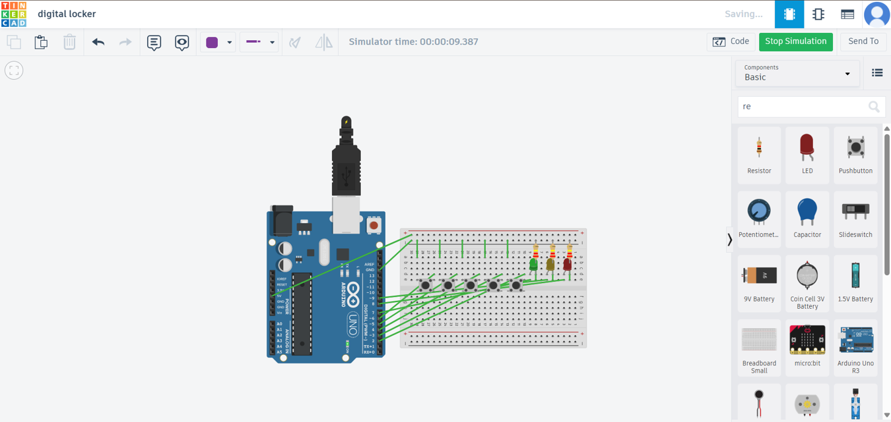
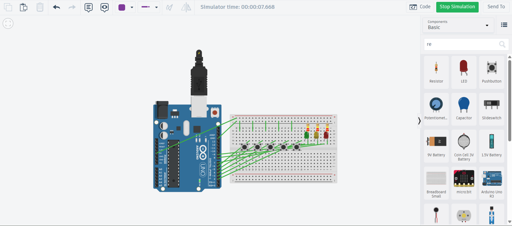
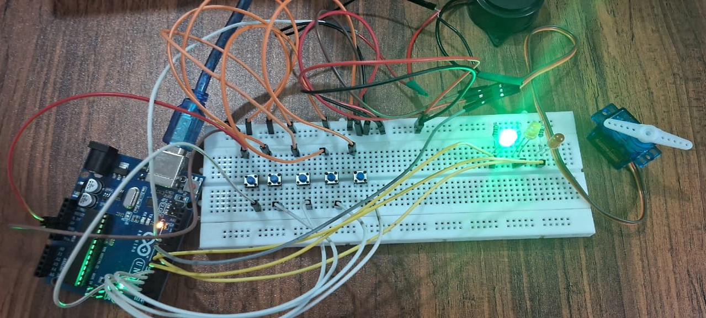

# 4-Bit Binary Multifunctional Digital Locker

## Overview

The 4-Bit Binary Multifunctional Digital Locker is a secure and cost-effective electronic locking system developed using Arduino Uno. The project replaces conventional key-based security with a binary password authentication mechanism, providing enhanced security, user feedback, and protection against unauthorized access.

The system uses a 4-bit binary password, servo motor-based locking mechanism, LED indicators, and a buzzer to create an interactive and reliable digital security solution.

## Problem Statement

Traditional mechanical locks are vulnerable to key loss, duplication, and unauthorized access. Many basic electronic locking systems also lack advanced security mechanisms and can be bypassed by simply resetting the power supply.

This project aims to develop a secure digital locker that:

* Eliminates the need for physical keys.
* Restricts repeated unauthorized access attempts.
* Provides clear visual and audible user feedback.
* Maintains security even after power interruptions.

## Objectives

* Design a keyless digital locking system using a 4-bit binary password.
* Implement a servo motor-based locking mechanism.
* Provide user feedback through LEDs and a buzzer.
* Enhance security using EEPROM-based attempt tracking.
* Develop a low-cost and reliable security solution using embedded systems.

## Features

* 4-bit binary password authentication
* Servo motor-controlled locking and unlocking
* Three-attempt security lockout
* EEPROM-based persistent memory
* Green LED for successful access indication
* Red LED for incorrect password indication
* Yellow LED for lockout indication
* Audible feedback using a piezo buzzer
* Support for multiple stored passwords
* Low-cost and scalable design

## System Components

* Arduino Uno
* Push Buttons
* LEDs (Green, Red, Yellow)
* Piezo Buzzer
* Servo Motor
* Breadboard and Resistors

## Working Principle

1. The user enters a 4-bit binary password using push buttons.
2. The Arduino verifies the entered password against stored credentials.
3. If the password is correct:

   * The locker unlocks.
   * Green LED glows.
   * Success tone is generated.
4. If the password is incorrect:

   * Red LED glows.
   * Error tone is generated.
   * Attempt count is increased.
5. After three consecutive failed attempts:

   * The system enters lockout mode.
   * Yellow LED indicates the lockout status.
   * Further access attempts are blocked until reset.

---

## Simulation

### Correct Password

### Wrong Password

### Locked

## Prototype

A hardware prototype was developed using Arduino Uno, push buttons, LEDs, a buzzer to demonstrate the real-world implementation of the digital locker system.

### Prototype Images

### Hardware Demo

## Applications

* Personal lockers
* Office storage systems
* Access control systems
* Smart security solutions
* Educational embedded system projects

---

## Technologies Used

* Arduino Uno
* Embedded C
* EEPROM Memory
* Servo Motor Control
* Digital Electronics
* Autodesk Tinkercad

---

## Future Enhancements

* Numeric keypad integration
* LCD display for user interaction
* Bluetooth-enabled access control
* Wi-Fi connectivity and remote monitoring
* RFID authentication
* Biometric security integration

